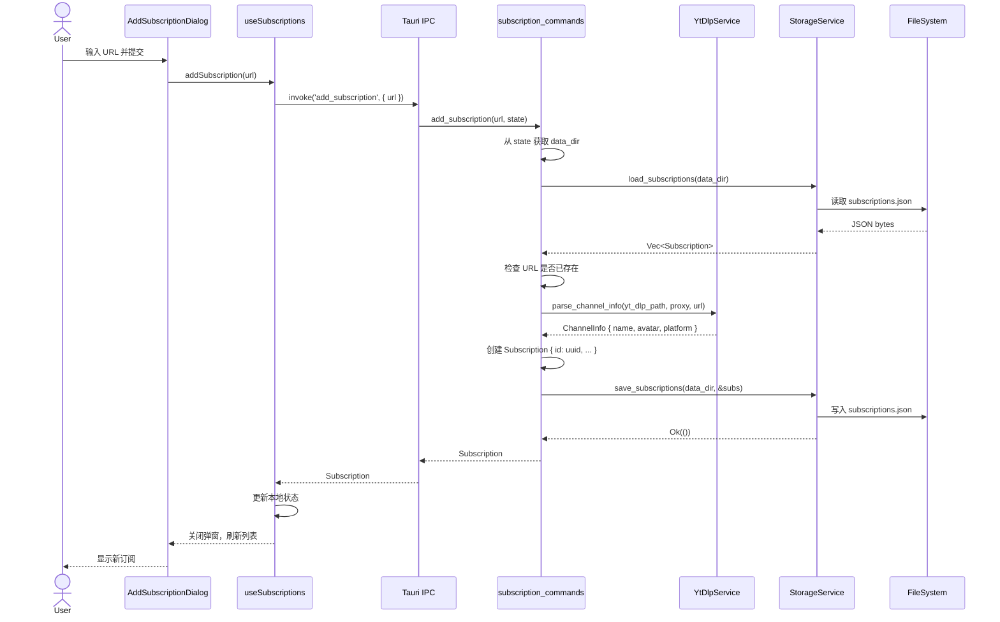
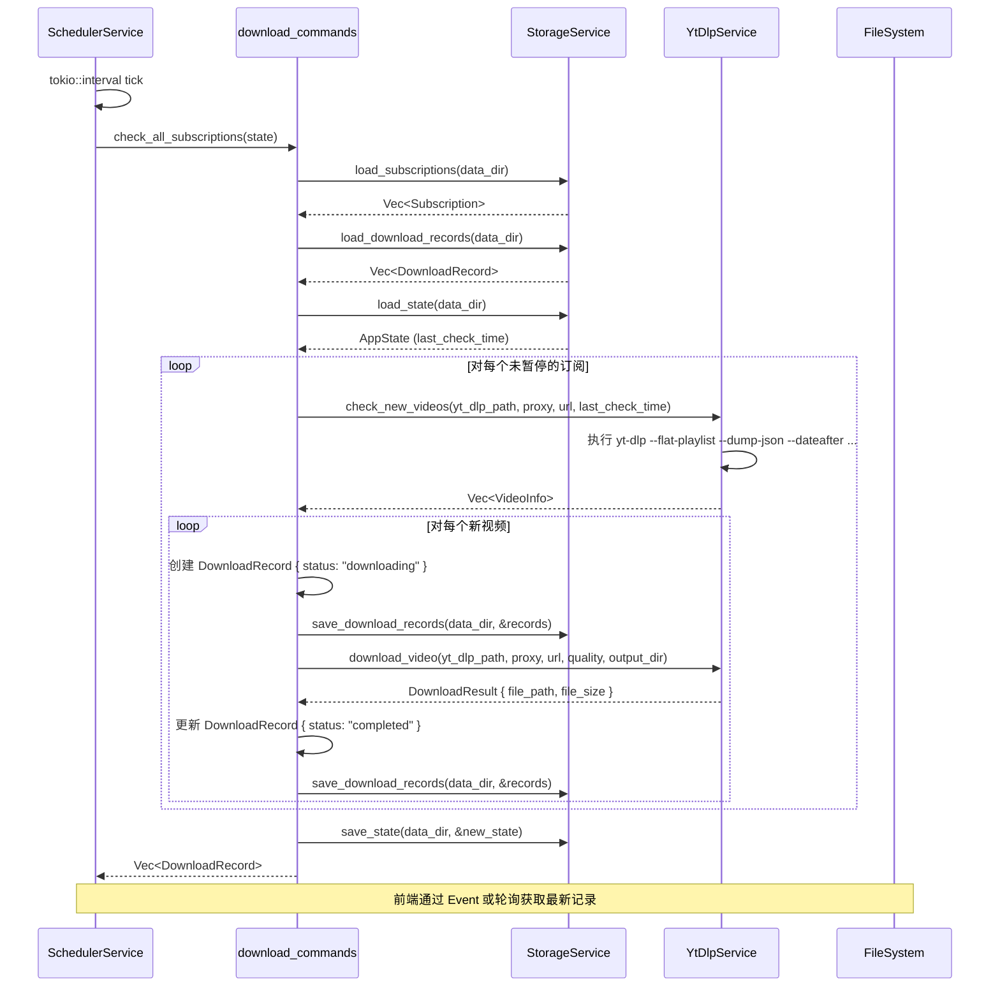
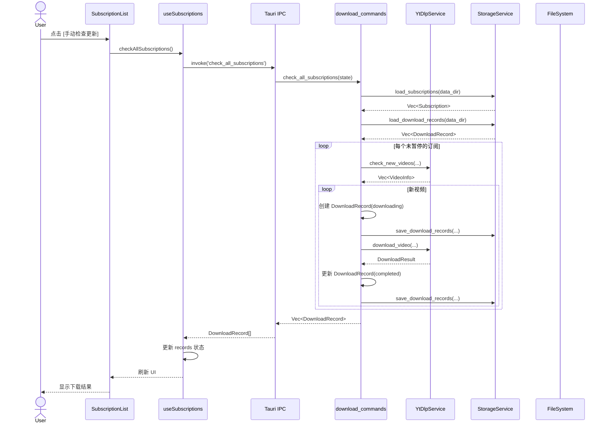
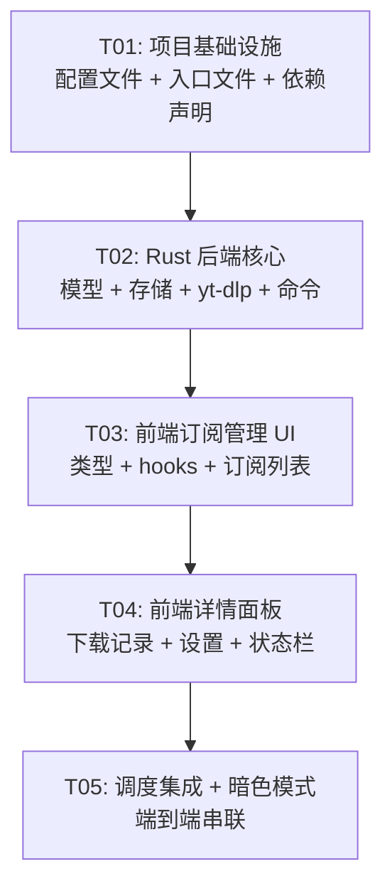

# yt-dlp 订阅管理器 — 系统架构设计

> **作者**: Bob (Architect)  
> **日期**: 2026-05-29  
> **基于**: PRD v1.0 (Alice, Product Manager)

---

## Part A: 系统设计

### 1. 实现方案

#### 1.1 整体架构

```
┌─────────────────────────────────────────────────────┐
│                    Frontend (WebView)                 │
│  React 18 + TypeScript + MUI 5 + Tailwind CSS 3     │
│                                                       │
│  ┌──────────┐ ┌──────────┐ ┌──────────┐             │
│  │ 订阅列表  │ │ 详情面板  │ │ 设置弹窗  │             │
│  └────┬─────┘ └────┬─────┘ └────┬─────┘             │
│       │             │             │                   │
│       └─────────────┼─────────────┘                   │
│                     │ invoke()                        │
├─────────────────────┼─────────────────────────────────┤
│              Tauri 2 IPC Bridge                       │
├─────────────────────┼─────────────────────────────────┤
│               Rust Backend                            │
│                                                       │
│  ┌──────────────┐  ┌──────────────┐                  │
│  │  Commands 层  │  │  Services 层  │                  │
│  │  (handler)   │──│  (business)  │                  │
│  └──────┬───────┘  └──────┬───────┘                  │
│         │                  │                          │
│  ┌──────┴──────────────────┴───────┐                 │
│  │         Models 层 (数据结构)      │                 │
│  └─────────────────────────────────┘                 │
│         │                  │                          │
│  ┌──────┴───────┐  ┌──────┴────────┐                 │
│  │ JSON Storage  │  │  yt-dlp CLI   │                 │
│  │ (~/.yt-dlp-   │  │  (subprocess) │                 │
│  │  sub-gui/)    │  │               │                 │
│  └──────────────┘  └───────────────┘                 │
└─────────────────────────────────────────────────────┘
```

#### 1.2 核心设计决策

| 决策点 | 选型 | 理由 |
|--------|------|------|
| **GUI 框架** | Tauri 2 | 用户指定，轻量（二进制 < 10MB），Rust 原生性能 |
| **前端框架** | React 18 + Vite 5 | 生态成熟，组件化开发效率高 |
| **UI 组件库** | MUI 5 (Joy UI) | 极简扁平风格开箱即用，内置暗色模式，无Ant Design的厚重感 |
| **CSS 工具** | Tailwind CSS 3 | 原子化样式，与 MUI 互补处理自定义布局 |
| **存储** | JSON 文件 + serde | 简单可靠，数据量小（订阅数通常 < 100）无需数据库 |
| **yt-dlp 调用** | `std::process::Command` | Rust 原生，无需额外依赖 |
| **定时调度** | `tokio::time::interval` | Tauri 2 内置 tokio runtime，零额外依赖 |
| **ID 生成** | `uuid` crate (v4) | 标准 UUID，无碰撞风险 |
| **序列化** | `serde` + `serde_json` | Rust 生态标准 |

#### 1.3 架构分层

```
┌──────────────────────────────────────────┐
│ 前端层 (React + TypeScript)              │
│ - 组件 (Components)                      │
│ - 自定义 Hooks (状态管理)                 │
│ - Tauri invoke 封装 (lib/tauri.ts)       │
├──────────────────────────────────────────┤
│ IPC 桥接层 (Tauri 自动生成)               │
├──────────────────────────────────────────┤
│ 命令层 (Commands)                        │
│ - subscription_commands                  │
│ - download_commands                      │
│ - settings_commands                      │
│ - scheduler_commands                     │
├──────────────────────────────────────────┤
│ 服务层 (Services) - 无状态纯函数           │
│ - StorageService: JSON 读写              │
│ - YtDlpService: CLI 封装                 │
│ - SchedulerService: 定时轮询管理          │
├──────────────────────────────────────────┤
│ 模型层 (Models)                          │
│ - Subscription, DownloadRecord           │
│ - AppSettings, AppState                  │
└──────────────────────────────────────────┘
```

**设计原则**：
- **Commands 层无业务逻辑**：仅做参数校验 + 调用 Service + 序列化返回
- **Services 层纯函数**：不持有状态，通过参数传入路径/配置
- **前端 Hooks 管理状态**：`useSubscriptions` / `useDownloadRecords` 封装数据获取与缓存
- **存储路径通过 Tauri `app_data_dir` 获取**，不硬编码

---

### 2. 文件列表

```
yt-dlp-gui/
├── index.html                          # Vite 入口 HTML
├── package.json                        # 前端依赖声明
├── tsconfig.json                       # TypeScript 配置
├── tsconfig.node.json                  # Node 工具链 TS 配置
├── vite.config.ts                      # Vite 构建配置
├── tailwind.config.ts                  # Tailwind CSS 配置
├── postcss.config.js                   # PostCSS 配置
│
├── src/                                # 前端源码
│   ├── main.tsx                        # React 入口
│   ├── App.tsx                         # 根组件（路由/布局）
│   ├── index.css                       # 全局样式 + Tailwind 指令
│   ├── vite-env.d.ts                   # Vite 类型声明
│   │
│   ├── types/
│   │   └── index.ts                    # 前端 TypeScript 类型定义
│   │
│   ├── lib/
│   │   └── tauri.ts                    # Tauri invoke 封装层
│   │
│   ├── hooks/
│   │   ├── useSubscriptions.ts         # 订阅列表状态管理
│   │   └── useDownloadRecords.ts       # 下载记录状态管理
│   │
│   ├── components/
│   │   ├── AppShell.tsx                # 主布局（两栏 + 顶栏 + 状态栏）
│   │   ├── TopBar.tsx                  # 顶栏（Logo + 标题 + 设置按钮）
│   │   ├── StatusBar.tsx               # 底栏（状态信息）
│   │   │
│   │   ├── SubscriptionList.tsx        # 订阅列表容器
│   │   ├── SubscriptionItem.tsx        # 单个订阅条目
│   │   ├── AddSubscriptionDialog.tsx   # 添加订阅弹窗
│   │   │
│   │   ├── DetailPanel.tsx             # 右侧详情面板容器
│   │   ├── DownloadRecordList.tsx      # 下载记录列表
│   │   ├── DownloadRecordItem.tsx      # 单条下载记录
│   │   │
│   │   └── SettingsDialog.tsx          # 设置弹窗
│   │
│   └── assets/
│       └── logo.svg                    # App 图标
│
├── src-tauri/                          # Rust 后端源码
│   ├── Cargo.toml                      # Rust 依赖声明
│   ├── tauri.conf.json                 # Tauri 配置
│   ├── build.rs                        # Tauri 构建脚本
│   ├── capabilities/
│   │   └── default.json               # Tauri 2 权限声明
│   │
│   ├── icons/                          # 应用图标（多尺寸）
│   │   ├── icon.ico
│   │   ├── icon.png
│   │   └── ...
│   │
│   └── src/
│       ├── main.rs                     # Tauri 入口（不暴露逻辑）
│       ├── lib.rs                      # 库根（注册 commands + 初始化）
│       │
│       ├── models/
│       │   ├── mod.rs                  # 模型模块导出
│       │   ├── subscription.rs         # Subscription 结构体
│       │   ├── download.rs             # DownloadRecord 结构体
│       │   └── settings.rs            # AppSettings 结构体
│       │
│       ├── commands/
│       │   ├── mod.rs                  # 命令模块导出
│       │   ├── subscription.rs         # 订阅相关 Tauri commands
│       │   ├── download.rs             # 下载相关 Tauri commands
│       │   └── settings.rs            # 设置相关 Tauri commands
│       │
│       ├── services/
│       │   ├── mod.rs                  # 服务模块导出
│       │   ├── storage.rs             # JSON 文件存储服务
│       │   ├── ytdlp.rs               # yt-dlp CLI 调用服务
│       │   └── scheduler.rs           # 定时轮询调度服务
│       │
│       └── utils/
│           ├── mod.rs                  # 工具模块导出
│           └── error.rs               # 统一错误类型
│
└── docs/
    ├── system_design.md               # 本文件
    ├── class-diagram.mermaid          # 类图
    └── sequence-diagram.mermaid       # 时序图
```

---

### 3. 数据结构和接口

#### 3.1 Rust 端数据模型

```mermaid
classDiagram
    direction TB

    class Subscription {
        +String id
        +String url
        +String platform
        +String channel_name
        +String channel_avatar_url
        +bool paused
        +String quality_preset
        +String created_at
        +new(url: String, platform: String, channel_name: String, channel_avatar_url: String) Subscription
    }

    class DownloadRecord {
        +String id
        +String subscription_id
        +String video_title
        +String video_url
        +String file_path
        +u64 file_size
        +String status
        +String downloaded_at
        +new(subscription_id: String, video_title: String, video_url: String, file_path: String) DownloadRecord
    }

    class AppSettings {
        +String download_dir
        +u32 check_interval_minutes
        +String yt_dlp_path
        +String quality_preset
        +bool notifications_enabled
        +bool dark_mode
        +String proxy_url
        +default() AppSettings
    }

    class AppState {
        +String last_check_time
        +u32 total_downloads
        +default() AppState
    }

    class StorageService {
        +load_subscriptions(data_dir: &Path) Vec~Subscription~
        +save_subscriptions(data_dir: &Path, subs: &[Subscription]) Result
        +load_download_records(data_dir: &Path) Vec~DownloadRecord~
        +save_download_records(data_dir: &Path, records: &[DownloadRecord]) Result
        +load_settings(data_dir: &Path) AppSettings
        +save_settings(data_dir: &Path, settings: &AppSettings) Result
        +load_state(data_dir: &Path) AppState
        +save_state(data_dir: &Path, state: &AppState) Result
    }

    class YtDlpService {
        +parse_channel_info(yt_dlp_path: &str, proxy: &Option~String~, url: &str) Result~ChannelInfo~
        +check_new_videos(yt_dlp_path: &str, proxy: &Option~String~, url: &str, since: &str) Result~Vec~VideoInfo~~
        +download_video(yt_dlp_path: &str, proxy: &Option~String~, url: &str, quality: &str, output_dir: &Path) Result~DownloadResult~
    }

    class SchedulerService {
        +start(interval_mins: u32, callback: impl Fn()) JoinHandle
        +stop(handle: JoinHandle)
    }

    class ChannelInfo {
        +String channel_name
        +String channel_url
        +String channel_avatar_url
        +String platform
    }

    class VideoInfo {
        +String title
        +String url
        +String upload_date
    }

    class DownloadResult {
        +String file_path
        +u64 file_size
    }

    class AppError {
        <<enum>>
        Io(std::io::Error)
        Serde(serde_json::Error)
        YtDlp(String)
        NotFound(String)
        Duplicate(String)
    }

    StorageService ..> Subscription
    StorageService ..> DownloadRecord
    StorageService ..> AppSettings
    StorageService ..> AppState
    YtDlpService ..> ChannelInfo
    YtDlpService ..> VideoInfo
    YtDlpService ..> DownloadResult
    YtDlpService ..> AppError
    StorageService ..> AppError
```



#### 3.2 Rust Tauri Commands 接口

```rust
// === subscription.rs ===

/// 添加订阅：解析频道信息 + 保存
#[tauri::command]
async fn add_subscription(
    url: String,
    state: tauri::State<'_, AppHandle>,
) -> Result<Subscription, String>;

/// 删除订阅（级联删除下载记录）
#[tauri::command]
async fn delete_subscription(
    id: String,
    state: tauri::State<'_, AppHandle>,
) -> Result<(), String>;

/// 获取所有订阅
#[tauri::command]
async fn get_subscriptions(
    state: tauri::State<'_, AppHandle>,
) -> Result<Vec<Subscription>, String>;

/// 暂停/恢复订阅
#[tauri::command]
async fn toggle_subscription_pause(
    id: String,
    state: tauri::State<'_, AppHandle>,
) -> Result<Subscription, String>;

/// 更新订阅画质
#[tauri::command]
async fn update_subscription_quality(
    id: String,
    quality_preset: String,
    state: tauri::State<'_, AppHandle>,
) -> Result<Subscription, String>;

// === download.rs ===

/// 手动触发检查新视频（单个订阅）
#[tauri::command]
async fn check_subscription(
    id: String,
    state: tauri::State<'_, AppHandle>,
) -> Result<Vec<DownloadRecord>, String>;

/// 检查所有订阅的新视频
#[tauri::command]
async fn check_all_subscriptions(
    state: tauri::State<'_, AppHandle>,
) -> Result<Vec<DownloadRecord>, String>;

/// 获取下载记录（可按订阅过滤）
#[tauri::command]
async fn get_download_records(
    subscription_id: Option<String>,
    state: tauri::State<'_, AppHandle>,
) -> Result<Vec<DownloadRecord>, String>;

/// 获取所有下载记录
#[tauri::command]
async fn get_all_download_records(
    state: tauri::State<'_, AppHandle>,
) -> Result<Vec<DownloadRecord>, String>;

// === settings.rs ===

/// 获取设置
#[tauri::command]
async fn get_settings(
    state: tauri::State<'_, AppHandle>,
) -> Result<AppSettings, String>;

/// 更新设置
#[tauri::command]
async fn update_settings(
    settings: AppSettings,
    state: tauri::State<'_, AppHandle>,
) -> Result<AppSettings, String>;

/// 获取应用状态（上次检查时间、总下载数等）
#[tauri::command]
async fn get_app_state(
    state: tauri::State<'_, AppHandle>,
) -> Result<AppState, String>;

/// 手动触发全量检查
#[tauri::command]
async fn manual_check_all(
    state: tauri::State<'_, AppHandle>,
) -> Result<Vec<DownloadRecord>, String>;

/// 启动定时检查
#[tauri::command]
async fn start_scheduler(
    state: tauri::State<'_, AppHandle>,
) -> Result<(), String>;

/// 停止定时检查
#[tauri::command]
async fn stop_scheduler(
    state: tauri::State<'_, AppHandle>,
) -> Result<(), String>;
```

#### 3.3 前端 TypeScript 类型

```typescript
// types/index.ts

interface Subscription {
  id: string;
  url: string;
  platform: 'youtube' | 'bilibili' | 'other';
  channel_name: string;
  channel_avatar_url: string;
  paused: boolean;
  quality_preset: string;
  created_at: string; // ISO 8601
}

interface DownloadRecord {
  id: string;
  subscription_id: string;
  video_title: string;
  video_url: string;
  file_path: string;
  file_size: number;
  status: 'downloading' | 'completed' | 'failed';
  downloaded_at: string; // ISO 8601
}

interface AppSettings {
  download_dir: string;
  check_interval_minutes: number;
  yt_dlp_path: string;
  quality_preset: string;
  notifications_enabled: boolean;
  dark_mode: boolean;
  proxy_url: string;
}

interface AppState {
  last_check_time: string | null;
  total_downloads: number;
}
```

---

### 4. 程序调用流程

#### 4.1 添加订阅



#### 4.2 自动检查新视频



#### 4.3 手动下载流程



---

### 5. 待明确事项

| # | 问题 | 假设 | 影响 |
|---|------|------|------|
| 1 | yt-dlp 捆绑分发的具体方式？嵌入资源还是安装时下载？ | 假设通过 Tauri `externalBin` 配置捆绑，构建时将 yt-dlp 二进制放在 `src-tauri/binaries/` | 影响 Cargo.toml 配置和 yt-dlp 更新策略 |
| 2 | macOS 上 yt-dlp 需要 Python 运行时吗？ | 假设使用 yt-dlp 独立二进制（通过 PyInstaller 打包），无需系统 Python | 影响安装包体积和兼容性说明 |
| 3 | 下载时是否需要显示进度？ | 假设 MVP 阶段只显示状态（downloading/completed/failed），P2 再加进度百分比 | 影响 Tauri event 设计 |
| 4 | Bilibili 平台是否需要 cookie 认证？ | 假设 MVP 先支持无需 cookie 的公开频道，后续通过设置页配置 cookie 路径 | 影响 yt-dlp 参数设计 |
| 5 | Tauri 2 的 `tauri::State` 中应该管理哪些全局状态？ | 假设管理：`data_dir`(PathBuf)、`settings: Mutex<AppSettings>`、`scheduler_handle: Mutex<Option<JoinHandle>>` | 影响 lib.rs 初始化代码 |

---

## Part B: 任务分解

### 6. 依赖包列表

#### Rust (Cargo.toml)

```toml
[dependencies]
tauri = { version = "2", features = [] }
tauri-plugin-shell = "2"
serde = { version = "1", features = ["derive"] }
serde_json = "1"
uuid = { version = "1", features = ["v4"] }
chrono = { version = "0.4", features = ["serde"] }
tokio = { version = "1", features = ["full"] }
thiserror = "2"
log = "0.4"
env_logger = "0.11"
```

#### 前端 (package.json)

```json
{
  "dependencies": {
    "react": "^18.3.0",
    "react-dom": "^18.3.0",
    "@mui/material": "^5.16.0",
    "@mui/icons-material": "^5.16.0",
    "@emotion/react": "^11.13.0",
    "@emotion/styled": "^11.13.0",
    "@tauri-apps/api": "^2.0.0",
    "@tauri-apps/plugin-shell": "^2.0.0"
  },
  "devDependencies": {
    "@types/react": "^18.3.0",
    "@types/react-dom": "^18.3.0",
    "@vitejs/plugin-react": "^4.3.0",
    "autoprefixer": "^10.4.0",
    "postcss": "^8.4.0",
    "tailwindcss": "^3.4.0",
    "typescript": "^5.5.0",
    "vite": "^5.4.0"
  }
}
```

---

### 7. 任务列表（按依赖排序）

| ID | 任务名称 | 源文件 | 依赖 | 优先级 |
|----|---------|--------|------|--------|
| **T01** | **项目基础设施** | `package.json`, `tsconfig.json`, `tsconfig.node.json`, `vite.config.ts`, `tailwind.config.ts`, `postcss.config.js`, `index.html`, `src/main.tsx`, `src/App.tsx`, `src/index.css`, `src/vite-env.d.ts`, `src-tauri/Cargo.toml`, `src-tauri/tauri.conf.json`, `src-tauri/build.rs`, `src-tauri/capabilities/default.json`, `src-tauri/src/main.rs`, `src-tauri/src/lib.rs`, `src/assets/logo.svg` | — | P0 |
| **T02** | **Rust 后端核心（模型 + 存储 + yt-dlp + 命令）** | `src-tauri/src/models/mod.rs`, `src-tauri/src/models/subscription.rs`, `src-tauri/src/models/download.rs`, `src-tauri/src/models/settings.rs`, `src-tauri/src/utils/mod.rs`, `src-tauri/src/utils/error.rs`, `src-tauri/src/services/mod.rs`, `src-tauri/src/services/storage.rs`, `src-tauri/src/services/ytdlp.rs`, `src-tauri/src/services/scheduler.rs`, `src-tauri/src/commands/mod.rs`, `src-tauri/src/commands/subscription.rs`, `src-tauri/src/commands/download.rs`, `src-tauri/src/commands/settings.rs`, `src-tauri/src/lib.rs`（注册 commands） | T01 | P0 |
| **T03** | **前端类型定义 + 订阅管理 UI** | `src/types/index.ts`, `src/lib/tauri.ts`, `src/hooks/useSubscriptions.ts`, `src/components/AppShell.tsx`, `src/components/TopBar.tsx`, `src/components/SubscriptionList.tsx`, `src/components/SubscriptionItem.tsx`, `src/components/AddSubscriptionDialog.tsx` | T02 | P0 |
| **T04** | **前端详情面板 + 下载记录 + 设置 + 状态栏** | `src/hooks/useDownloadRecords.ts`, `src/components/DetailPanel.tsx`, `src/components/DownloadRecordList.tsx`, `src/components/DownloadRecordItem.tsx`, `src/components/SettingsDialog.tsx`, `src/components/StatusBar.tsx` | T03 | P0 |
| **T05** | **定时调度集成 + 端到端串联 + 暗色模式** | `src-tauri/src/lib.rs`（启动调度器）, `src/App.tsx`（暗色模式 + 最终集成）, `src/index.css`（暗色模式样式）, `src/components/AppShell.tsx`（集成联动） | T04 | P1 |

**任务覆盖的需求映射**：

| 需求 | 覆盖任务 |
|------|----------|
| P0-1 添加订阅 | T02 (Rust 命令), T03 (前端 UI) |
| P0-2 删除订阅 | T02 (Rust 命令), T03 (前端 UI) |
| P0-3 订阅列表展示 | T03 (前端 UI) |
| P0-4 调用 yt-dlp 下载 | T02 (YtDlpService), T04 (下载记录 UI) |
| P0-5 自动检测新视频 | T02 (SchedulerService), T05 (调度器集成) |
| P0-6 下载目录配置 | T02 (Settings), T04 (SettingsDialog) |
| P1-1 下载历史记录 | T02 (模型+存储), T04 (DownloadRecordList) |
| P1-2 画质/格式选择 | T02 (模型字段), T04 (SettingsDialog + AddSubscriptionDialog) |
| P1-3 检查间隔可配置 | T02 (Settings), T04 (SettingsDialog), T05 (调度器) |
| P1-4 暂停/恢复订阅 | T02 (toggle 命令), T03 (SubscriptionItem) |
| P1-5 手动触发检查 | T02 (manual_check_all), T04 (按钮) |
| P2-1 批量导入 | 未纳入 MVP 任务（后续迭代） |
| P2-2 OPML/JSON 导出 | 未纳入 MVP 任务（后续迭代） |
| P2-3 下载完成通知 | 未纳入 MVP 任务（后续迭代） |
| P2-4 暗色模式 | T05 (MUI 主题切换) |
| P2-5 代理设置 | T04 (SettingsDialog 代理字段) |

---

### 8. 共享知识

#### 8.1 JSON 存储格式

```
~/.yt-dlp-sub-gui/
├── subscriptions.json     # [{...}, {...}]
├── download_records.json  # [{...}, {...}]
├── settings.json          # {...}
└── state.json             # {...}
```

**subscriptions.json**:
```json
[
  {
    "id": "uuid-v4",
    "url": "https://www.youtube.com/@channel",
    "platform": "youtube",
    "channel_name": "频道名称",
    "channel_avatar_url": "https://...",
    "paused": false,
    "quality_preset": "1080p",
    "created_at": "2026-05-29T12:00:00Z"
  }
]
```

**download_records.json**:
```json
[
  {
    "id": "uuid-v4",
    "subscription_id": "uuid-v4",
    "video_title": "视频标题",
    "video_url": "https://...",
    "file_path": "/downloads/video.mp4",
    "file_size": 123456789,
    "status": "completed",
    "downloaded_at": "2026-05-29T14:00:00Z"
  }
]
```

**settings.json**:
```json
{
  "download_dir": "/home/user/Videos/yt-dlp",
  "check_interval_minutes": 360,
  "yt_dlp_path": "yt-dlp",
  "quality_preset": "1080p",
  "notifications_enabled": false,
  "dark_mode": false,
  "proxy_url": ""
}
```

**state.json**:
```json
{
  "last_check_time": "2026-05-29T13:55:00Z",
  "total_downloads": 47
}
```

#### 8.2 命名约定

| 类别 | 约定 | 示例 |
|------|------|------|
| Rust 文件名 | `snake_case` | `subscription.rs`, `download_record.rs` |
| Rust 结构体 | `PascalCase` | `Subscription`, `DownloadRecord` |
| Rust 函数/方法 | `snake_case` | `add_subscription`, `check_all` |
| Rust Tauri command | `snake_case`（自动映射到前端 `snake_case`） | `add_subscription` |
| TypeScript 文件名 | `PascalCase`（组件）、`camelCase`（其他） | `SubscriptionList.tsx`, `useSubscriptions.ts` |
| TypeScript 接口 | `PascalCase` | `Subscription`, `DownloadRecord` |
| TypeScript 函数 | `camelCase` | `addSubscription`, `checkAll` |
| CSS 类名 | Tailwind 原子类优先，自定义类用 `kebab-case` | `subscription-item` |

#### 8.3 错误处理策略

- **Rust 端**：使用 `thiserror` 定义 `AppError` 枚举，所有 Service 返回 `Result<T, AppError>`
- **Tauri Command**：返回 `Result<T, String>`，在 Command 层将 `AppError` 转为用户可读的 `String`
- **前端**：每个 `invoke()` 调用包裹 `try/catch`，失败时用 MUI `Alert` 或 `Snackbar` 提示
- **yt-dlp 调用失败**：捕获 stderr，包装为 `AppError::YtDlp(stderr_message)`
- **存储读写失败**：首次启动时自动创建默认文件和目录，读写失败返回 `AppError::Io`

#### 8.4 yt-dlp 调用规范

```rust
// 解析频道信息
yt-dlp --dump-json --playlist-items 0 <url>   → 提取 channel, channel_url, thumbnails

// 检查新视频（获取上次检查后的视频列表）
yt-dlp --flat-playlist --dump-json --dateafter <YYYYMMDD> <url>

// 下载视频
yt-dlp -f "bestvideo[height<=1080]+bestaudio/best[height<=1080]" -o "<output_dir>/%(title)s.%(ext)s" <url>
```

- **代理**：通过 `--proxy <proxy_url>` 参数传递
- **输出解析**：逐行读取 stdout，每行一个 JSON 对象
- **超时**：单次 yt-dlp 调用最多等待 30 分钟（大文件下载），通过 `std::process::Child::wait_timeout` 或 tokio 超时控制

#### 8.5 全局状态管理

Rust 端通过 `tauri::State` 管理全局状态：

```rust
struct AppContext {
    data_dir: PathBuf,           // ~/.yt-dlp-sub-gui/
    settings: Mutex<AppSettings>, // 运行时设置缓存
}
```

前端通过 React Hooks 管理状态，不引入 Redux/Zustand（数据量小，不需要全局 store）。

#### 8.6 Tauri 2 关键配置

**tauri.conf.json** 核心字段：
```json
{
  "identifier": "com.ytdlp-sub-gui.app",
  "build": {
    "frontendDist": "../dist",
    "devUrl": "http://localhost:5173"
  },
  "bundle": {
    "externalBin": ["binaries/yt-dlp"]
  },
  "app": {
    "withGlobalTauri": true
  }
}
```

**capabilities/default.json**（权限声明）：
```json
{
  "identifier": "default",
  "windows": ["main"],
  "permissions": [
    "core:default",
    "shell:allow-open"
  ]
}
```

---

### 9. 任务依赖图



---

> **设计结束**。请 Engineer 严格按照本文档的任务顺序和接口定义进行实现。如有接口疑问，请通过 team-lead 反馈给 Architect。
