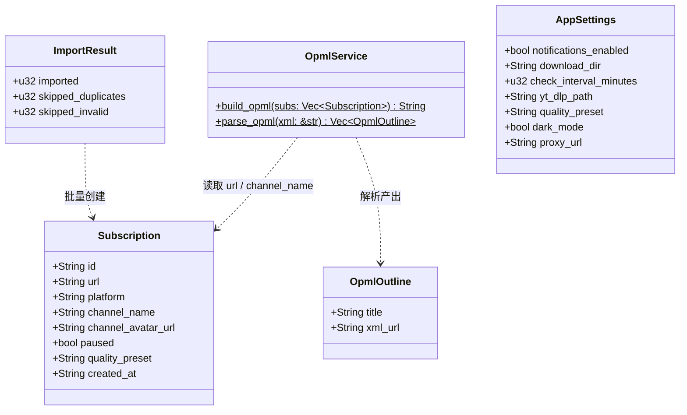
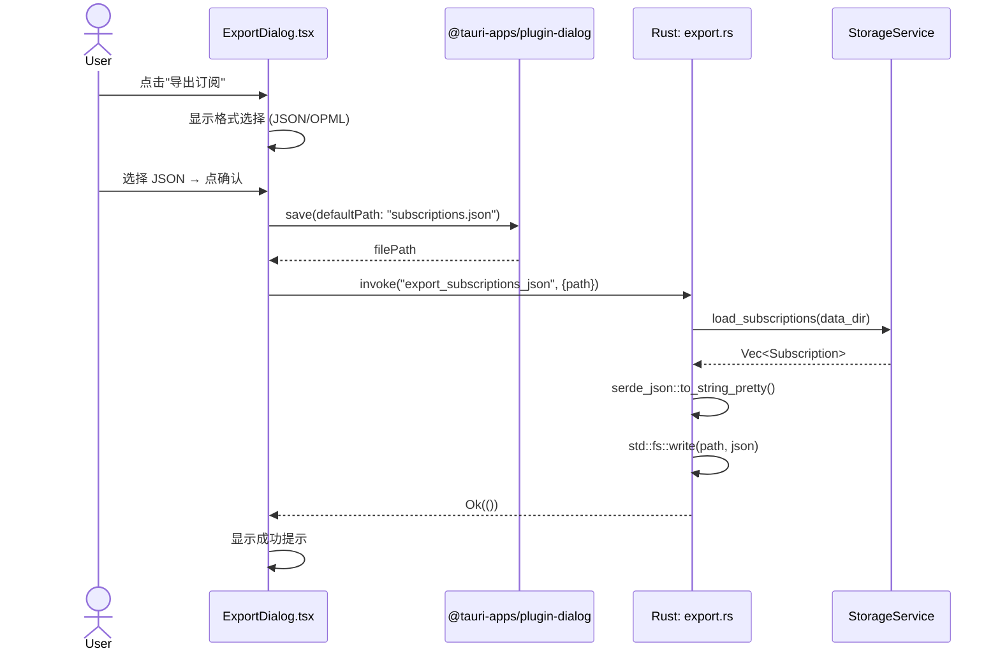
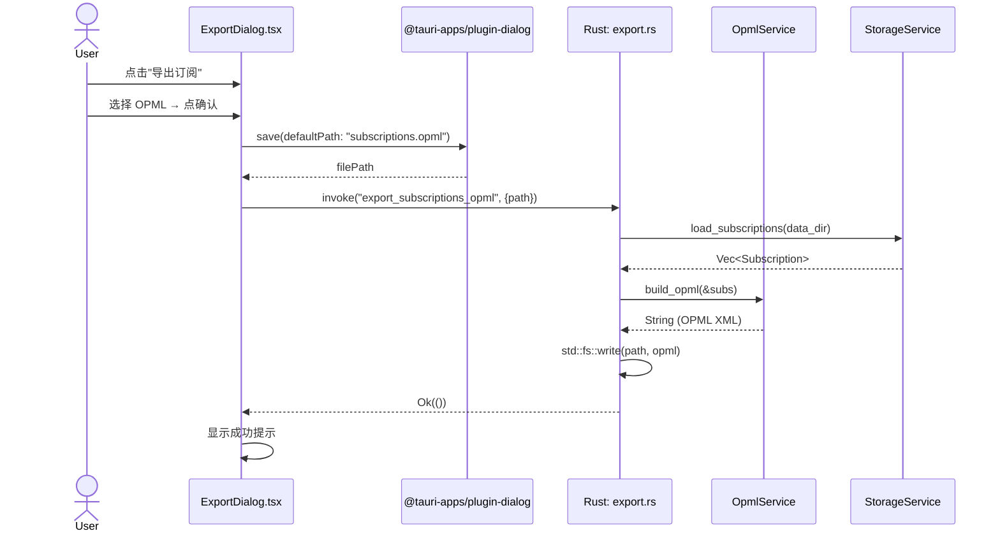
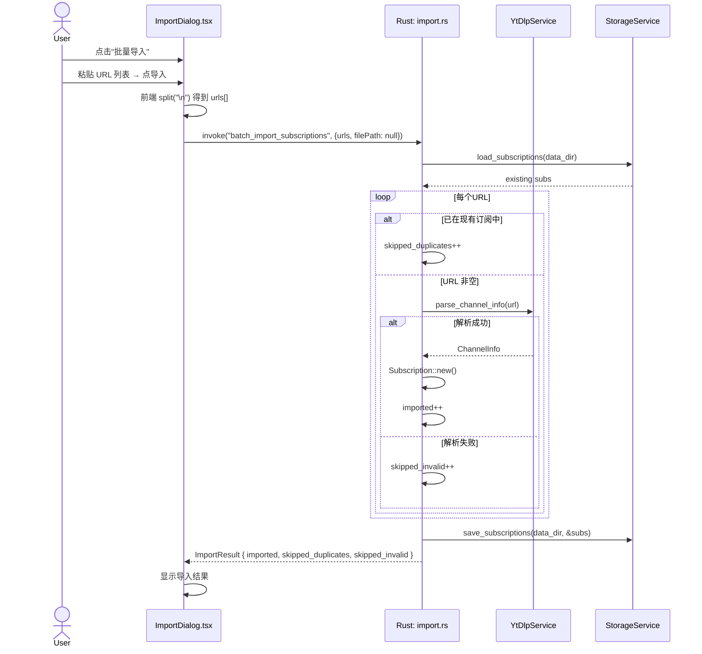
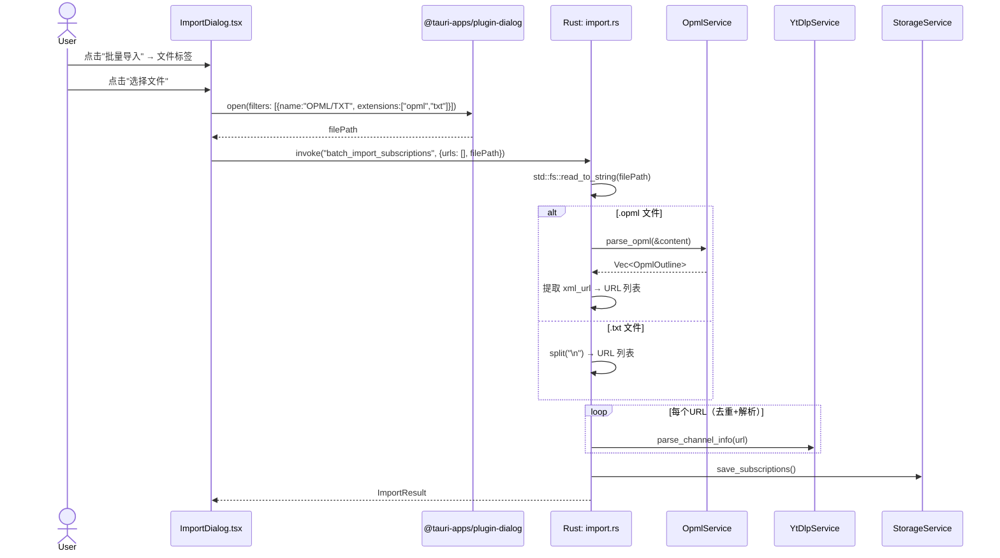
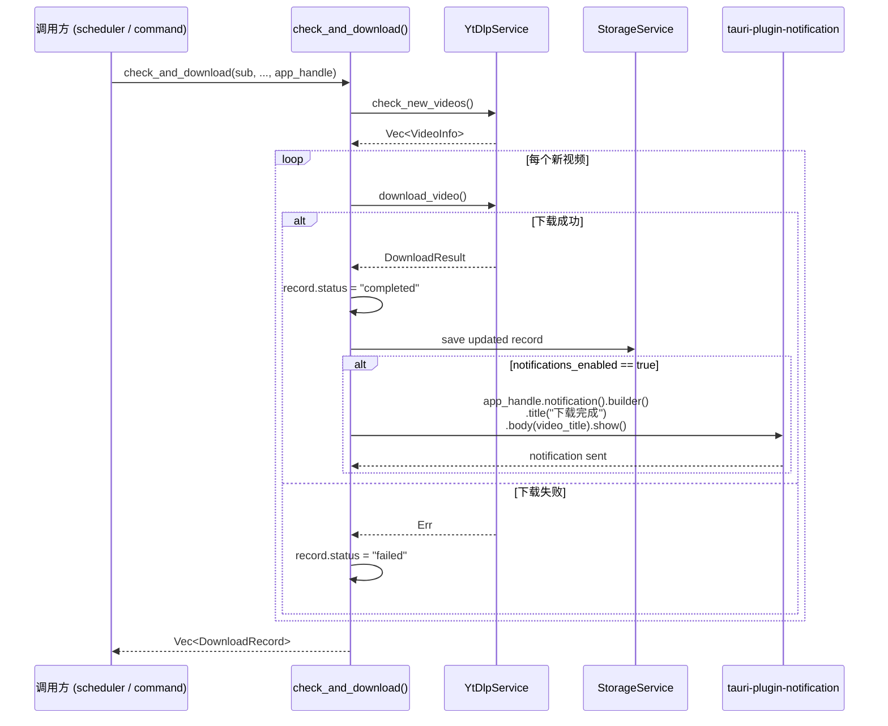
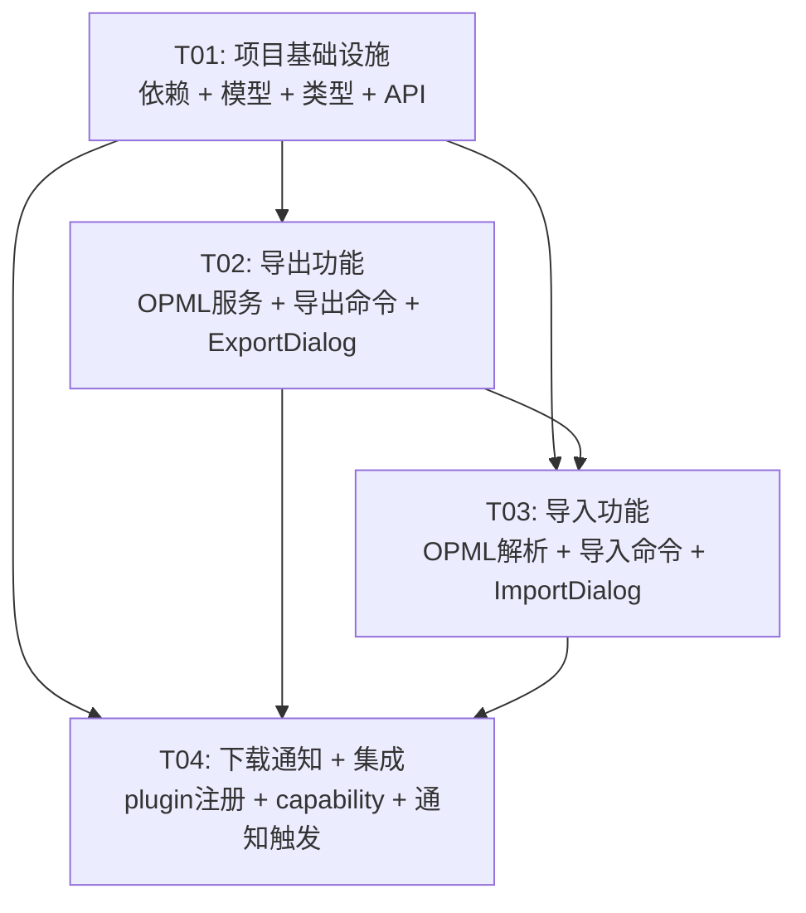

# yt-dlp GUI - P2 增量架构设计

> **角色**: 软件架构师 (Bob)
> **范围**: 仅描述 P2 增量变更，不重新设计整个系统
> **基准**: v0.1.0 现有代码库

---

## Part A: 系统设计（增量）

### A.1 实现方案

#### 核心技术挑战

| 挑战 | 分析 | 方案 |
|------|------|------|
| OPML XML 构建/解析 | OPML 是简单 XML，无需重量级库 | 导出用字符串模板构建；导入用 `quick-xml` 轻量解析 |
| 文件保存/打开对话框 | Tauri 2 原生对话框 | `@tauri-apps/plugin-dialog` 的 `save()` / `open()` |
| 系统通知 | 跨平台桌面通知 | `tauri-plugin-notification` (Rust 端) + `@tauri-apps/plugin-notification` (前端权限请求) |
| 下载完成后触发通知 | 通知需在 `check_and_download()` 内部触发 | 修改函数签名，传入 `&tauri::AppHandle`；通过 `NotificationExt` 发送 |

#### 框架与库选择

| 用途 | 选择 | 理由 |
|------|------|------|
| Rust OPML 解析 | `quick-xml` v0.37 | 轻量、零拷贝、广泛使用 |
| Rust 系统通知 | `tauri-plugin-notification` v2 | Tauri 官方插件，跨平台 |
| 前端文件对话框 | `@tauri-apps/plugin-dialog` v2 | Tauri 官方插件 |
| 前端通知权限 | `@tauri-apps/plugin-notification` v2 | 权限请求 |

#### 最小变更原则

- 优先在现有模块内新增函数，而非创建大量新模块
- 两个新 command 模块：`commands/export.rs`、`commands/import.rs`
- 一个公共服务：`services/opml.rs`
- 一个新数据模型：`models/import_export.rs`
- 现有 `commands/download.rs` 仅修改 `check_and_download()` 函数签名和内部逻辑
- 现有 `lib.rs` 仅新增 plugin 注册和 command 注册

---

### A.2 变更文件清单

#### 新增文件

| 文件 | 说明 | 关联功能 |
|------|------|---------|
| `src-tauri/src/models/import_export.rs` | ImportResult, OpmlOutline 结构体 | P2-1, P2-2 |
| `src-tauri/src/services/opml.rs` | OpmlService: build_opml() + parse_opml() | P2-1, P2-2 |
| `src-tauri/src/commands/export.rs` | export_subscriptions_json, export_subscriptions_opml | P2-2 |
| `src-tauri/src/commands/import.rs` | batch_import_subscriptions | P2-1 |
| `src/components/ExportDialog.tsx` | 导出格式选择对话框 (MUI Dialog + RadioGroup) | P2-2 |
| `src/components/ImportDialog.tsx` | 批量导入对话框 (MUI Dialog + Tabs: 粘贴/文件) | P2-1 |

#### 修改文件

| 文件 | 变更内容 | 关联功能 |
|------|---------|---------|
| `src-tauri/Cargo.toml` | 新增 `quick-xml`, `tauri-plugin-notification` 依赖 | P2-1, P2-3 |
| `package.json` | 新增 `@tauri-apps/plugin-dialog`, `@tauri-apps/plugin-notification` | P2-1, P2-2, P2-3 |
| `src-tauri/src/lib.rs` | 注册 notification plugin；注册 3 个新 command；新增 `mod import_export` | P2-1, P2-2, P2-3 |
| `src-tauri/src/models/mod.rs` | 新增 `pub mod import_export;` + re-export | P2-1 |
| `src-tauri/src/commands/mod.rs` | 新增 `pub mod export; pub mod import;` | P2-1, P2-2 |
| `src-tauri/capabilities/default.json` | 新增 `notification:default`, `dialog:default` 权限 | P2-1, P2-2, P2-3 |
| `src-tauri/src/commands/download.rs` | `check_and_download()` 签名新增 `app: &tauri::AppHandle`；下载成功后发送通知 | P2-3 |
| `src/types/index.ts` | 新增 `ImportResult`, `OpmlOutline` 类型 | P2-1 |
| `src/lib/tauri.ts` | 新增 `exportJson`, `exportOpml`, `batchImport` API 封装 | P2-1, P2-2 |
| `src/components/AppShell.tsx` | 集成 ExportDialog / ImportDialog；TopBar 添加入口 | P2-1, P2-2 |

---

### A.3 新增数据结构与接口



#### ImportResult

```rust
#[derive(Debug, Clone, Serialize, Deserialize)]
pub struct ImportResult {
    /// 成功导入的订阅数
    pub imported: u32,
    /// 因重复跳过的数量
    pub skipped_duplicates: u32,
    /// 因 URL 无效跳过的数量
    pub skipped_invalid: u32,
}
```

#### OpmlOutline

```rust
#[derive(Debug, Clone, Serialize, Deserialize)]
pub struct OpmlOutline {
    pub title: String,
    pub xml_url: String,
}
```

---

### A.4 新增 Tauri Commands

#### P2-2: 导出

```rust
// commands/export.rs

/// 导出所有订阅为 JSON 文件（直接复制 subscriptions.json 内容）
#[tauri::command]
pub async fn export_subscriptions_json(
    path: String,
    state: State<'_, AppContext>,
) -> Result<(), String>;

/// 导出所有订阅为 OPML 文件（构建标准 OPML 2.0 XML）
#[tauri::command]
pub async fn export_subscriptions_opml(
    path: String,
    state: State<'_, AppContext>,
) -> Result<(), String>;
```

#### P2-1: 批量导入

```rust
// commands/import.rs

/// 批量导入订阅
/// - urls: 粘贴模式下的 URL 列表（换行分割后的数组）
/// - file_path: 文件模式下的文件路径（.txt 或 .opml），与 urls 互斥
#[tauri::command]
pub async fn batch_import_subscriptions(
    urls: Vec<String>,
    file_path: Option<String>,
    state: State<'_, AppContext>,
) -> Result<ImportResult, String>;
```

#### P2-3: 通知（修改现有）

```rust
// commands/download.rs — 函数签名变更

// Before:
pub(crate) async fn check_and_download(
    sub: &Subscription,
    yt_dlp_path: &str,
    proxy: &Option<String>,
    download_dir: &PathBuf,
    data_dir: &PathBuf,
    last_check_time: &Option<String>,
    existing_records: &[DownloadRecord],
) -> Result<Vec<DownloadRecord>, AppError>;

// After: 新增 app_handle 参数
pub(crate) async fn check_and_download(
    sub: &Subscription,
    yt_dlp_path: &str,
    proxy: &Option<String>,
    download_dir: &PathBuf,
    data_dir: &PathBuf,
    last_check_time: &Option<String>,
    existing_records: &[DownloadRecord],
    app_handle: &tauri::AppHandle,  // ← NEW
) -> Result<Vec<DownloadRecord>, AppError>;
```

---

### A.5 程序调用流程

#### 导出 JSON 流程



#### 导出 OPML 流程



#### 批量导入（粘贴模式）流程



#### 批量导入（OPML 文件模式）流程



#### 下载完成通知流程



---

### A.6 依赖变更详情

#### Cargo.toml 新增

```toml
# OPML XML 解析（仅用于导入阶段）
quick-xml = { version = "0.37", features = ["serialize"] }
# 系统桌面通知
tauri-plugin-notification = "2"
```

#### package.json 新增

```json
{
  "@tauri-apps/plugin-dialog": "^2.0.0",
  "@tauri-apps/plugin-notification": "^2.0.0"
}
```

#### Capability 变更 (`capabilities/default.json`)

```json
{
  "identifier": "default",
  "description": "Default capability for the main window",
  "windows": ["main"],
  "permissions": [
    "core:default",
    "shell:allow-open",
    "notification:default",
    "dialog:default"
  ]
}
```

---

### A.7 关键设计决策

1. **OPML 导出用字符串模板**：OPML 2.0 结构极其简单（`<head>` + `<body>` + `<outline>`），直接使用 `format!()` 宏构建，避免引入 XML writer 依赖。

2. **OPML 导入用 quick-xml**：解析不可信的外部 OPML 文件需要健壮的 XML 解析，`quick-xml` 是最轻量的选择（零依赖，事件驱动）。

3. **通知在 Rust 端触发**：通知逻辑放在 `check_and_download()` 内部。原因：
   - 无论是手动触发还是调度器触发，都在同一位置发送通知
   - 避免前端轮询下载状态
   - `notifications_enabled` 设置已在 Rust 内存缓存中（`AppContext.settings`）

4. **`check_and_download()` 签名变更影响面**：该函数是 `pub(crate)`，调用方包括：
   - `lib.rs` 调度器循环
   - `commands/download.rs` 的三个 command handler
   - 共 4 处调用点需传递 `app_handle`

5. **导入为同步阻塞操作**：`batch_import_subscriptions` 内部逐 URL 调用 `parse_channel_info`（同步 CLI 调用），在 `#[tauri::command] async` 中通过 `tokio::task::spawn_blocking` 包装，避免阻塞事件循环。

---

### A.8 待明确事项

| 事项 | 假设 | 影响 |
|------|------|------|
| OPML 导入时若 URL 解析失败是否回滚已导入的 | 不回滚，逐个导入，跳过失败的 | ImportResult 设计支持 |
| .txt 文件编码 | 假设 UTF-8 | 文件读取用 `std::fs::read_to_string` |
| 导出路径是否需校验父目录存在 | `std::fs::write` 不自动创建父目录；假设用户通过对话框选择已有目录 | 不额外处理，写失败返回错误 |
| 通知是否需要图标 | 使用默认系统图标 | 不自定义 icon |
| 调度器和手动检查的通知行为一致 | 都检查 `notifications_enabled` | 一个判断点 |

---

## Part B: 任务分解

### B.6 所需依赖包

**Rust (Cargo.toml 新增):**
```
- quick-xml@^0.37: OPML XML 解析（导入）
- tauri-plugin-notification@^2: 系统桌面通知
```

**前端 (package.json 新增):**
```
- @tauri-apps/plugin-dialog@^2.0.0: 文件保存/打开对话框
- @tauri-apps/plugin-notification@^2.0.0: 通知权限请求（前端侧）
```

---

### B.7 任务列表（按依赖顺序）

#### T01: 项目基础设施（优先级 P0）

| 属性 | 内容 |
|------|------|
| **Task ID** | T01 |
| **Task Name** | 项目基础设施：依赖声明 + 数据模型 + 类型定义 + API 封装 + 模块注册 |
| **Source Files** | `src-tauri/Cargo.toml` (MODIFY), `package.json` (MODIFY), `src-tauri/src/models/import_export.rs` (NEW), `src-tauri/src/models/mod.rs` (MODIFY), `src-tauri/src/commands/mod.rs` (MODIFY), `src/types/index.ts` (MODIFY), `src/lib/tauri.ts` (MODIFY) |
| **Dependencies** | 无 |
| **Priority** | P0 |

**工作内容:**
1. `Cargo.toml`: 添加 `quick-xml`、`tauri-plugin-notification` 依赖
2. `package.json`: 添加 `@tauri-apps/plugin-dialog`、`@tauri-apps/plugin-notification`
3. `src-tauri/src/models/import_export.rs`: 定义 `ImportResult`、`OpmlOutline` 结构体（含 Serialize/Deserialize）
4. `src-tauri/src/models/mod.rs`: 添加 `pub mod import_export;` + re-export
5. `src-tauri/src/commands/mod.rs`: 添加 `pub mod export; pub mod import;`
6. `src/types/index.ts`: 新增 `ImportResult`、`OpmlOutline` TypeScript 接口
7. `src/lib/tauri.ts`: 新增 `exportSubscriptionsJson(path)`, `exportSubscriptionsOpml(path)`, `batchImportSubscriptions(urls, filePath?)` 三个 invoke 封装

---

#### T02: 导出功能（优先级 P0）

| 属性 | 内容 |
|------|------|
| **Task ID** | T02 |
| **Task Name** | 导出功能：OPML 服务 + 导出命令 + ExportDialog 组件 |
| **Source Files** | `src-tauri/src/services/opml.rs` (NEW), `src-tauri/src/commands/export.rs` (NEW), `src/components/ExportDialog.tsx` (NEW) |
| **Dependencies** | T01 |
| **Priority** | P0 |

**工作内容:**
1. `services/opml.rs`: 实现 `OpmlService::build_opml(&[Subscription]) -> String`（字符串模板构建 OPML 2.0 XML）
2. `commands/export.rs`: 实现 `export_subscriptions_json`（读取 subs → serde_json → fs::write）和 `export_subscriptions_opml`（读取 subs → OpmlService::build_opml → fs::write）
3. `components/ExportDialog.tsx`: MUI Dialog 组件
   - RadioGroup: JSON / OPML 格式选择
   - 确认按钮 → 调用 `@tauri-apps/plugin-dialog` 的 `save()` 获取路径 → 调用对应的 Rust command
   - 成功/失败 snackbar 提示

---

#### T03: 导入功能（优先级 P0）

| 属性 | 内容 |
|------|------|
| **Task ID** | T03 |
| **Task Name** | 导入功能：OPML 解析 + 导入命令 + ImportDialog 组件 + AppShell 集成 |
| **Source Files** | `src-tauri/src/commands/import.rs` (NEW), `src/components/ImportDialog.tsx` (NEW), `src/components/AppShell.tsx` (MODIFY) |
| **Dependencies** | T01, T02 (复用 `services/opml.rs` 的 `parse_opml`) |
| **Priority** | P0 |

**工作内容:**
1. `services/opml.rs`: 新增 `OpmlService::parse_opml(xml: &str) -> Result<Vec<OpmlOutline>, AppError>`（使用 quick-xml 解析 `<outline>` 元素，提取 `text` 和 `xmlUrl` 属性）
2. `commands/import.rs`: 实现 `batch_import_subscriptions`
   - 若 `file_path` 为 Some + .opml → 读取文件 → `OpmlService::parse_opml` → 提取 URL 列表
   - 若 `file_path` 为 Some + .txt → 读取文件 → split("\n") → URL 列表
   - 若 `urls` 非空 → 直接使用
   - 逐 URL 去重检查 → `YtDlpService::parse_channel_info` → 创建 Subscription → 保存
   - 返回 `ImportResult`
3. `components/ImportDialog.tsx`: MUI Dialog + Tabs
   - 粘贴标签: Textarea → 前端 split → 传 `urls`
   - 文件标签: Button → `@tauri-apps/plugin-dialog` `open()` → 传 `filePath`
   - 结果展示: Alert 显示 imported / skipped_duplicates / skipped_invalid
4. `components/AppShell.tsx`: 集成 ImportDialog（新增 state + 导入按钮入口在 TopBar 或 SubscriptionList 工具栏）

---

#### T04: 下载通知 + 最终集成（优先级 P1）

| 属性 | 内容 |
|------|------|
| **Task ID** | T04 |
| **Task Name** | 下载完成通知：lib.rs 插件注册 + capability 权限 + download.rs 通知触发 |
| **Source Files** | `src-tauri/src/lib.rs` (MODIFY), `src-tauri/capabilities/default.json` (MODIFY), `src-tauri/src/commands/download.rs` (MODIFY) |
| **Dependencies** | T01, T02, T03 |
| **Priority** | P1 |

**工作内容:**
1. `lib.rs`:
   - 在 `tauri::Builder::default()` 链中添加 `.plugin(tauri_plugin_notification::init())`
   - 在 `generate_handler![]` 中添加 `commands::export::export_subscriptions_json`, `commands::export::export_subscriptions_opml`, `commands::import::batch_import_subscriptions`
   - 调度器循环中 `check_and_download()` 调用传入 `&app_handle`
2. `capabilities/default.json`: 添加 `"notification:default"`, `"dialog:default"` 权限
3. `commands/download.rs`:
   - `check_and_download()` 签名新增 `app_handle: &tauri::AppHandle`
   - 在 `download_video()` 成功分支中：检查 `notifications_enabled`（从 `AppHandle` 获取 state → settings）→ 调用 `app_handle.notification().builder().title("下载完成").body(video_title).show()`
   - 更新所有 4 处调用点（`check_subscription`, `check_all_subscriptions`, `manual_check_all`, scheduler loop）传入 `app_handle`

---

### B.8 共享知识

```
- 所有 Tauri command 返回 Result<T, String>，通过 .map_err(|e| e.to_string()) 转换 AppError
- 通知标题固定为 "下载完成"，body 为视频标题
- OPML 2.0 格式: <?xml version="1.0" encoding="UTF-8"?><opml version="2.0"><head><title>...</title></head><body><outline text="..." title="..." type="rss" xmlUrl="..."/></body></opml>
- 文件路径使用系统原生分隔符（std::path::Path 自动处理）
- check_and_download 是 pub(crate)，同时被 lib.rs 调度器和 commands/download.rs 调用
- notifications_enabled 从 AppContext.settings (Mutex<AppSettings>) 读取
- 通知 API: app_handle.notification().builder().title(...).body(...).show()
- ImportDialog 中粘贴 URL 按换行分割，过滤空行
- ExportDialog 中默认文件名为 subscriptions.json 或 subscriptions.opml
- @tauri-apps/plugin-dialog 的 save()/open() 需在用户交互事件中调用（按钮 onClick）
```

---

### B.9 任务依赖图



**依赖说明:**
- T02、T03 都依赖 T01 的模型/类型定义和模块注册
- T03 依赖 T02 提供的 `services/opml.rs`（`parse_opml` 函数在 T02 中创建文件框架，T03 中实现解析逻辑）
- T04 依赖 T01（plugin 在 Cargo.toml）、T02（export commands 注册）、T03（import commands 注册），是所有功能的最终集成点

---

> **文档版本**: v1.0 | **作者**: Bob (Architect) | **日期**: 2026-05-29
